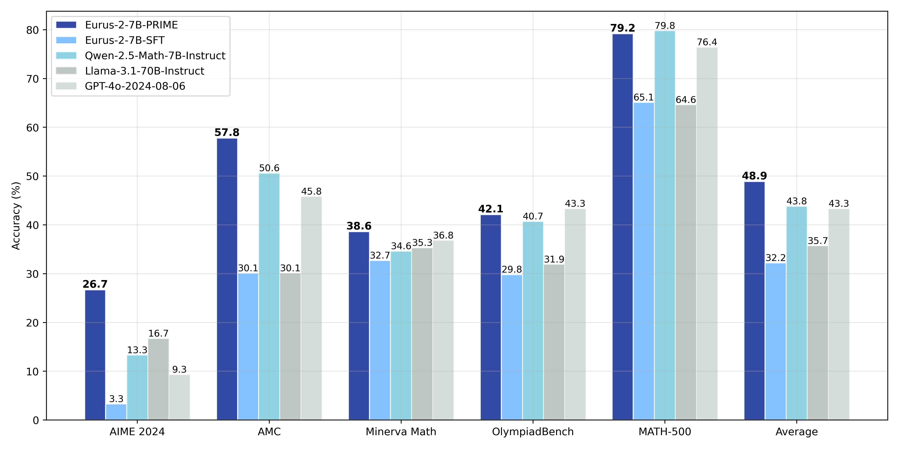

<div align="center">

# Process Reinforcement Through Implicit Rewards

[](https://github.com/PRIME-RL/PRIME)  [](https://curvy-check-498.notion.site/Process-Reinforcement-through-Implicit-Rewards-15f4fcb9c42180f1b498cc9b2eaf896f)  [](https://huggingface.co/PRIME-RL)

<div align="center" style="font-family: Arial, sans-serif;">
  <p>
    <a href="#🎉news" style="text-decoration: none; font-weight: bold;">🎉 News</a> •
    <a href="#🔗links" style="text-decoration: none; font-weight: bold;">🔗 Links</a> •
    <a href="#✨getting-started" style="text-decoration: none; font-weight: bold;">✨ Getting Started</a> •
    <a href="#📖introduction" style="text-decoration: none; font-weight: bold;">📖 Introduction</a>
  </p>
  <p>
    <a href="#🔧usage" style="text-decoration: none; font-weight: bold;">🔧 Usage</a> •
    <a href="#📃evaluation" style="text-decoration: none; font-weight: bold;">📃 Evaluation</a> •
    <a href="#🎈citation" style="text-decoration: none; font-weight: bold;">🎈 Citation</a> •
    <a href="#📈star-history" style="text-decoration: none; font-weight: bold;">📈 Star History</a>
  </p>
</div>

</div>


# 🎉News

- **[2025/01/06]** We release the training/eval/data_preprocessing code. Enjoy! We are working on the paper and will release it very soon.
- **[2025/01/02]** We present **PRIME** (Process Reinforcement through IMplicit REwards), an open-source solution for online RL with process rewards, to advance reasoning abilities of language models beyond imitation or distillation. All models and data released through [HuggingFace](https://huggingface.co/PRIME-RL).

# 🔗Links

- 📜 [Blog](https://curvy-check-498.notion.site/Process-Reinforcement-through-Implicit-Rewards-15f4fcb9c42180f1b498cc9b2eaf896f)
- 🤗 [PRIME Collection](https://huggingface.co/PRIME-RL)

# ✨Getting Started

Currently, we provide the following code of PRIME, you can find more details in each directory.
- ``training``: Implementation and training scripts for PRIME.
- ``data_preprocessing``: Data preparation, especially math data for PRIME.
- ``eval``: Evaluation scripts to reproduce PRIME results.
- For Implicit PRM training and eval, please refer to [this repo](https://github.com/PRIME-RL/ImplicitPRM).

# 📖Introduction



Advanced reasoning of large language models (LLMs), while improvable through data-driven imitation, is still clouded by serious scalability challenges. We believe the key to overcoming such challenges lies in transforming data-driven approaches into *exploration-based* methods, as exemplified by reinforcement learning (RL). To this end, two critical bottlenecks need to be alleviated to bridge this transformation: (1) how to obtain precise *reward signals* efficiently and scalably, especially for *dense* ones? (2) how can we build effective RL algorithms to fully *unleash* the potential of these signals? 


We seek the **scalable** path towards advanced reasoning capabilities with **efficient reward modeling and reinforcement learning**. Our work stems from the implicit process reward modeling (PRM) objective. Without the need for any process label, implicit PRM is trained as an outcome reward model (ORM) and then used as a PRM. Besides improving model performance through inference scaling, the true power of the implicit PRM is unveiled in online RL training. Specifically, it brings three benefits to RL:
- **Dense Reward:** Implicit PRM directly learns a Q-function that provides rewards for *each token*, which alleviates the reward sparsity issue without the need of an extra value model.
- **Scalability:** Implicit PRM can be online updated with only outcome label. Therefore, we can directly update the PRM with on-policy rollouts given outcome verifiers, which mitigates the distribution shift as well as scalability issues for PRMs.
- **Simplicity:** Implicit PRM is inherently a language model. In practice, we show that it is unnecessary to train a PRM beforehand, since the SFT model itself already serves as a strong starting point.

We then dive into RL to figure out its key algorithm designs and implementation techniques. To this end, we present Process Reinforcement through IMplicit rEwards, PRIME, which effectively incorporates and updates PRMs in RL. 


As shown in the animation above, in PRIME, the policy model and PRM are both initialized with the SFT model. For each RL iteration, the policy model first generates rollouts. Then, the [implicit PRM](https://arxiv.org/abs/2412.01981) and outcome verifier score the rollouts, and the implicit PRM gets updated on the rollouts with the outcome reward. Finally, the outcome reward $r_o$ and process reward $r_p$ are combined and used to update the policy model. 

The PRIME implementation pseudocode is as follows:


The algorithm flow includes:

1. **Prompt filtering** based on policy model performance, only preserving those on which the policy model $\pi_\theta$ achieves a accuracy between 0.2 and 0.8.
2. **Calculate implicit process reward** $r^t$.
3. **Update Implicit PRM** $\pi_\psi$ based on predicted implicit process reward $r^t$ and ground truth outcome label $r$.
4. **Advantage estimation with RLOO.** Specifically, we first calculate the return of outcome rewards and implicit process rewards separately:

- For ground truth outcome rewards, we directly adopt RLOO without any modification.

- For implicit process rewards, we perform a three-step process to calculate return: (1) Use the averaged implicit process rewards to calculate the leave-one-out baseline (2) Normalize the process reward at step $t$ by subtracting the baseline; (3) Calculate the discounted return for each response.

  Finally, advantage is set to the combination of both returns. 

​    5. **Update the policy** $\pi_\theta$ using PPO loss for legit importance sampling.


# 🔧Usage
We apply tailored prompts for coding and math task:

**Coding**

```
{question} + "\n\nWrite Python code to solve the problem. Present the code in \n```python\nYour code\n```\nat the end.
```
**Math**
```
{question} + "\n\nPresent the answer in LaTex format: \\boxed{Your answer}"
```
<details> 
<summary>Click to view inference code.</summary>


```python
import os
from tqdm import tqdm
import torch
from transformers import AutoTokenizer
from vllm import LLM, SamplingParams
os.environ["NCCL_IGNORE_DISABLED_P2P"] = "1"
os.environ["TOKENIZERS_PARALLELISM"] = "true"
def generate(question_list,model_path):
    llm = LLM(
        model=model_path,
        trust_remote_code=True,
        tensor_parallel_size=torch.cuda.device_count(),
        gpu_memory_utilization=0.90,
    )
    sampling_params = SamplingParams(max_tokens=8192,
                                    temperature=0.0,
                                    n=1)
    outputs = llm.generate(question_list, sampling_params, use_tqdm=True)
    completions = [[output.text for output in output_item.outputs] for output_item in outputs]
    return completions
def make_conv_hf(question, tokenizer):
    # for math problem
    content = question + "\n\nPresent the answer in LaTex format: \\boxed{Your answer}"
    # for code problem
    # content = question + "\n\nWrite Python code to solve the problem. Present the code in \n```python\nYour code\n```\nat the end." 
    msg = [
        {"role": "user", "content": content}
    ]
    chat = tokenizer.apply_chat_template(msg, tokenize=False, add_generation_prompt=True)
    return chat
    
def run():
    model_path = "PRIME-RL/Eurus-2-7B-PRIME"
    all_problems = [
        "which number is larger? 9.11 or 9.9?"
    ]
    tokenizer = AutoTokenizer.from_pretrained(model_path)
    completions = generate([make_conv_hf(problem_data, tokenizer) for problem_data in all_problems],model_path)
    print(completions)
    # [['[ASSESS]\n\n# The problem asks us to compare two decimal numbers, 9.11 and 9.9, to determine which one is larger.\n# We need to compare the whole parts and the decimal parts of the numbers.\n\nNext action: [ADVANCE]\n\n# Compare the whole parts of the numbers: both 9.11 and 9.9 have the same whole part, which is 9.\n# Compare the decimal parts of the numbers: 0.11 (from 9.11) is less than 0.9 (from 9.9).\n\nNext action: [ADVANCE]\n\n# Since the whole parts are the same and the decimal part of 9.9 is greater than the decimal part of 9.11, we can conclude that 9.9 is larger than 9.11.\n\nNext action: [OUTPUT]\n\nThe final answer is $\\boxed{9.9}$.\n\n']]
if __name__ == "__main__":
    run()
```

</details> 

# 📃Evaluation

Through PRIME, we successfully achieve substantial improvements on key reasoning benchmarks over our SFT version of the model, leading to **16.7%** improvement on average, and over **20%** on AMC&AIME competitions. Our final model Eurus-2-7B-PRIME, based on Qwen-2.5-Math-7B-Base, surpassed its instruct version on 5 key reasoning benchmarks. 
The final results are presented below:
|               | **Eurus-2-7B-PRIME** | **Eurus-2-7B-SFT** | **Qwen-2.5-Math-7B-Instruct** | **Llama-3.1-70B-Instruct** | **GPT-4o** |
| ------------- | -------------------- | ------------------ | ----------------------------- | -------------------------- | ---------- |
| AIME 2024     | **26.7 (+23.3)**     | 3.3                | 13.3                          | 16.7                       | 9.3        |
| MATH-500      | 79.2 (+14.1)         | 65.1               | **79.8**                      | 64.6                       | 76.4       |
| AMC           | **57.8 (+27.7)**     | 30.1               | 50.6                          | 30.1                       | 45.8       |
| Minerva Math  | **38.6 (+5.9)**      | 32.7               | 34.6                          | 35.3                       | 36.8       |
| OlympiadBench | 42.1 (+12.3)         | 29.8               | 40.7                          | 31.9                       | **43.3**   |
| Avg.          | **48.9 (+16.7)**     | 32.2               | 43.8                          | 35.7                       | 43.3       |


We achieved this with only 1/10 data and model resources compared with Qwen-Math.
|            | **Eurus-2-7B-PRIME**               | **Qwen2.5-Math-7B-Instruct**    |
| ---------- | ---------------------------------- | ------------------------------- |
| Base Model | Qwen2.5-Math-7B                    | Qwen2.5-Math-7B                 |
| SFT Data   | **230K (open-source)**             | 2.5M (open-source and in-house) |
| RM Data    | **0**                              | 618K (in-house)                 |
| RM         | **Eurus-2-7B-SFT**                 | Qwen2.5-Math-RM (72B)           |
| RL Data    | **150K queries × 4 samples**  | 66K queries × 32 samples   |

# 🎈Citation
If you find PRIME or ImplicitPRM helpful, please cite us.

```bibtex
@misc{cui2024process,
  title={Process Reinforcement through Implicit Rewards},
  author={Ganqu Cui and Lifan Yuan and Zefan Wang and Hanbin Wang and Wendi Li and Bingxiang He and Yuchen Fan and Tianyu Yu and Qixin Xu and Weize Chen and Jiarui Yuan and Huayu Chen and Kaiyan Zhang and Xingtai Lv and Shuo Wang and Yuan Yao and Hao Peng and Yu Cheng and Zhiyuan Liu and Maosong Sun and Bowen Zhou and Ning Ding},
  year={2025},
  howpublished={\url{https://curvy-check-498.notion.site/Process-Reinforcement-through-Implicit-Rewards-15f4fcb9c42180f1b498cc9b2eaf896f}},
  note={Notion Blog}
}
```

```bibtex
@article{yuan2024implicitprm,
  title={Free Process Rewards without Process Labels},
  author={Lifan Yuan and Wendi Li and Huayu Chen and Ganqu Cui and Ning Ding and Kaiyan Zhang and Bowen Zhou and Zhiyuan Liu and Hao Peng},
  journal={arXiv preprint arXiv:2412.01981},
  year={2024}
}
```

# 📈Star History

[](https://star-history.com/#PRIME-RL/PRIME&Date)
